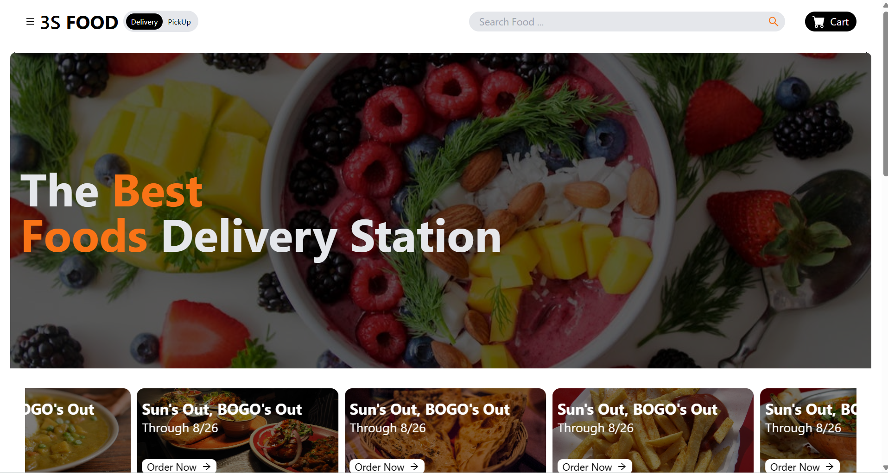
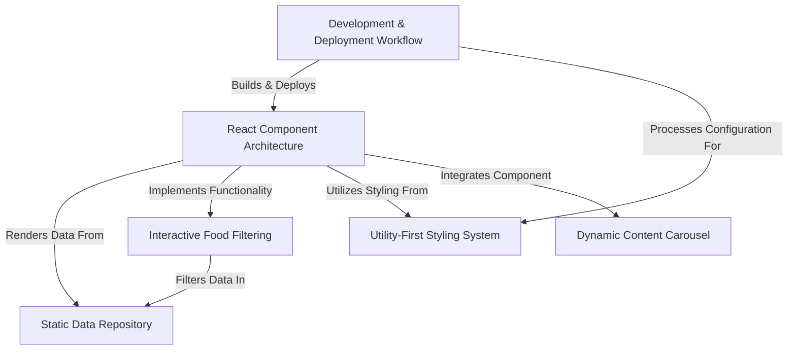

# Tutorial: 3s-food-delivery

This project is a *simple food delivery application* built using **React**. It allows users to browse a variety of **food items** and *categories*, filter meals by type and price, and view special offers through a *dynamic content carousel*. The application is styled efficiently using a utility-first approach and is set up for rapid development and deployment.

## Visist 📌 <a href="https://subash-0.github.io/3s-food-delivery/"> 3S Food </a>

## Visual Overview

### Visuals

### Sequence Diagram

